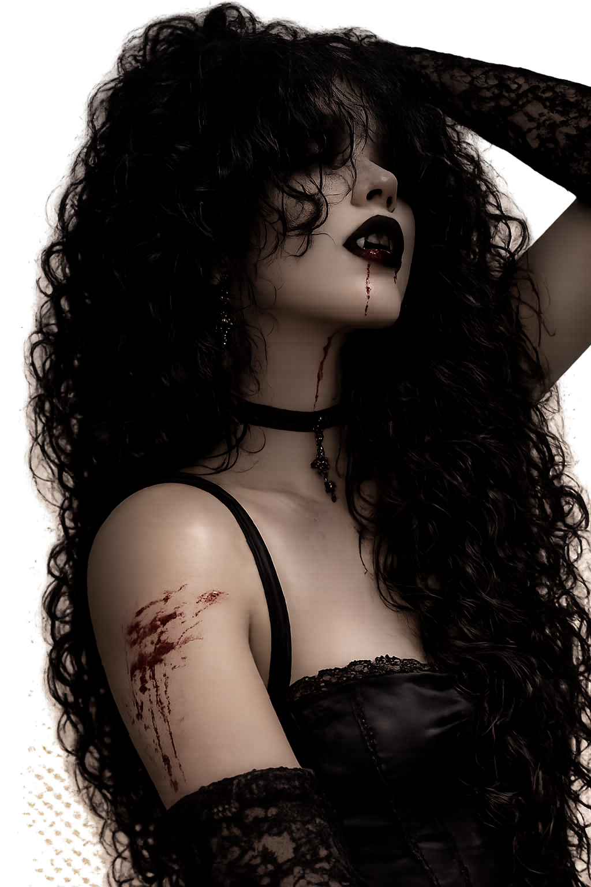
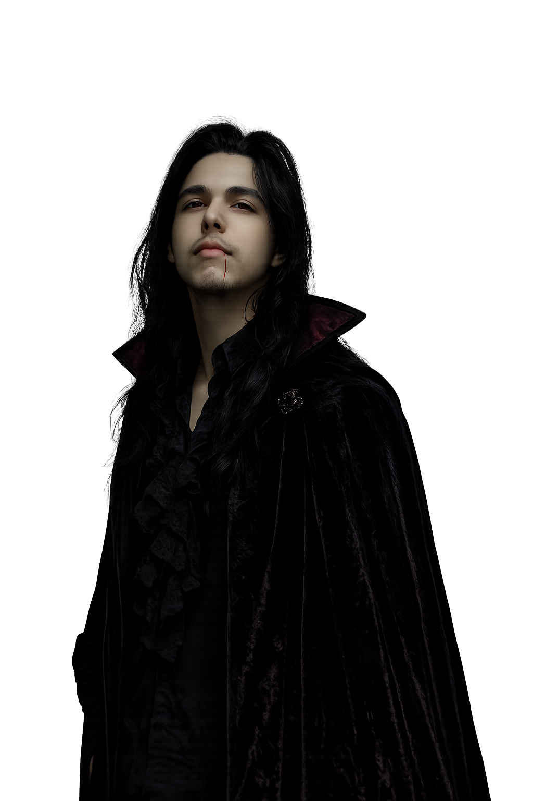

# 🖤 Novela Gótica: El Refugio de Noctis 🌙

¡Bienvenida a nuestra pequeña historia eterna, mi preciosa **Aranxita**! Esta es una novela visual creada con todo mi amor, donde nuestras almas se encuentran en un castillo rodeado de sombras y misterio.

  
  

---

## ✨ Una Historia para Nosotros
En este rincón digital, exploraremos juntos los pasillos de **Noctis**, tomando decisiones que forjarán nuestro destino. Es un regalo para ti, para que siempre tengas un lugar mágico al cual volver.

### 📜 Características
*   **Atmósfera Gótica:** Un diseño oscuro y elegante, como nosotros.
*   **Efectos Visuales:** Niebla, partículas de sangre y un aura de misterio.
*   **Música Envolvente:** Melodías que acompañan cada suspiro de la historia.
*   **Guardado de Progreso:** Para que nunca pierdas nuestro camino.

---

## 🌹 Hecho con amor por Franxito
Este proyecto no es solo código; es una carta de amor interactiva. Espero que disfrutes navegando por sus páginas tanto como yo disfruté creándolo para ti.

---

### 🛠️ Tecnologías
*   **React + TypeScript**
*   **Framer Motion** (para la magia del movimiento)
*   **Vite** (para la velocidad del rayo)
*   **Tailwind CSS** (para la elegancia gótica)

---

  <i>"En la oscuridad más profunda, tu luz es lo único que guía mi camino."</i>

